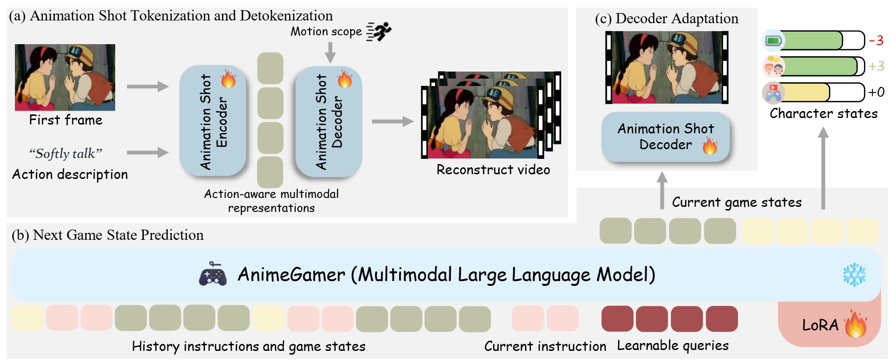

# AnimeGamer: Infinite Anime Life Simulation with Next Game State Prediction

**[Junhao Cheng<sup>1,2</sup>](https://donahowe.github.io/), 
[Yuying Ge<sup>1,&#9993;</sup>](https://geyuying.github.io/), 
[Yixiao Ge<sup>1</sup>](https://geyixiao.com/), 
[Jing Liao<sup>2</sup>](https://scholar.google.com/citations?user=3s9f9VIAAAAJ&hl=en), 
[Ying Shan<sup>1</sup>](https://scholar.google.com/citations?user=4oXBp9UAAAAJ&hl=en)**
<br>
<sup>1</sup>ARC Lab, Tencent PCG, 
<sup>2</sup>City University of Hong Kong
<br>

[](https://howe125.github.io/AnimeGamer.github.io/)
[](https://arxiv.org/abs/2504.01014)
[](https://huggingface.co/TencentARC/AnimeGamer)


## 🔎 Introduction
**Experience the endless adventure of infinite anime life with AnimeGamer!** 🤩


You can step into the shoes of Sosuke from "Ponyo on the Cliff" and interact with a dynamic game world through open-ended language instructions. AnimeGamer generates consistent multi-turn game states, consisting of dynamic animation shots (i.e., videos ) with contextual consistency (e.g., the purple car
and the forest background), and updates to character states including stamina, social, and entertainment values.


With AnimeGamer, you can bring together beloved characters like Qiqi from "Qiqi's Delivery Service" and Pazu from "Castle in the Sky" to meet and interact in the anime world. Imagine Pazu mastering Qiqi's broom-flying skills, creating unique and magical experiences. AnimeGamer can generalize interactions between characters from different anime films and character actions, with the potential for endless possibilities.

## :book: Method



AnimeGamer is built upon Multimodal Large Language Models (MLLMs) to generate each game state, including dynamic animation shots that depict character movements and updates to character states. The overview of AnimeGamer is as follows. The training process consists of three phases:
* (a) We model animation shots using action-aware multimodal representations through an encoder and train a diffusion-based decoder to reconstruct videos, with the additional input of motion scope that indicates action intensity. 
* (b) We train an MLLM to predict the next game state representations by taking the history instructions and game state representations as input.
* (c) We further enhance the quality of decoded animation shots from the MLLM via an adaptation phase, where the decoder is fine-tuned by taking MLLM's predictions as input.


## 📅 News

* [2025-04-02] Release wights of models separately trained on "Qiqi's Delivery Service" and "Ponyo on the cliff" 🔥
* [2025-04-02] Release paper in [arXiv](https://arxiv.org/abs/2504.01014) 🔥🔥🔥
* [2025-04-01] Release inference codes 🔥🔥🔥
* [2025-03-28] Create the repository 🔥🔥🔥


## 🔜 TODOs
- [ ] Release data processing pipeline
- [ ] Release training codes 
- [ ] Release wights of models trained on a mixture of anime films (the same setting as in our paper)

## 📏 Quick Start

Please first download the checkpoints of [AnimeGamer](https://huggingface.co/TencentARC/AnimeGamer) and [Mistral-7B](https://huggingface.co/mistralai/Mistral-7B-Instruct-v0.1), and save them under the folder `./checkpoints`.

To set up the environment for inference, you can run the following command:
```shell
git clone https://github.com/TencentARC/AnimeGamer.git
cd AnimeGamer
conda create -n animegamer python==3.10 -y
conda activate animegamer
pip install -r requirements.txt
```

To generate action-aware multimodal representations and update character states, you can run:
```shell
python inference_MLLM.py 
```

To decode the representations into animation shots, you can run:
```shell
python inference_Decoder.py 
```

Change the instructions in `./game_demo` to customize your play.


## 🤗 Acknowledgements

We refer to [CogvideoX](https://github.com/XLabs-AI/x-flux) and [SEED-X](https://github.com/AILab-CVC/SEED-X/tree/main) to build our codebase. Thanks for their wonderful project.


## 📜 Citation

If you find this work helpful, please consider citing:

```BibTeXw
@article{cheng2025animegamer,
  title={AnimeGamer: Infinite Anime Life Simulation with Next Game State Prediction},
  author={Cheng, Junhao and Ge, Yuying and Ge, Yixiao and Liao, Jing and Shan, Ying},
  journal={arXiv preprint arXiv:2504.01014},
  year={2025}
}
```
